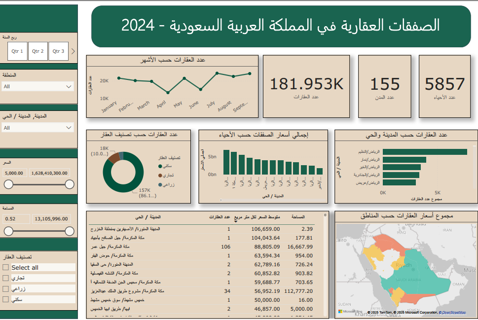
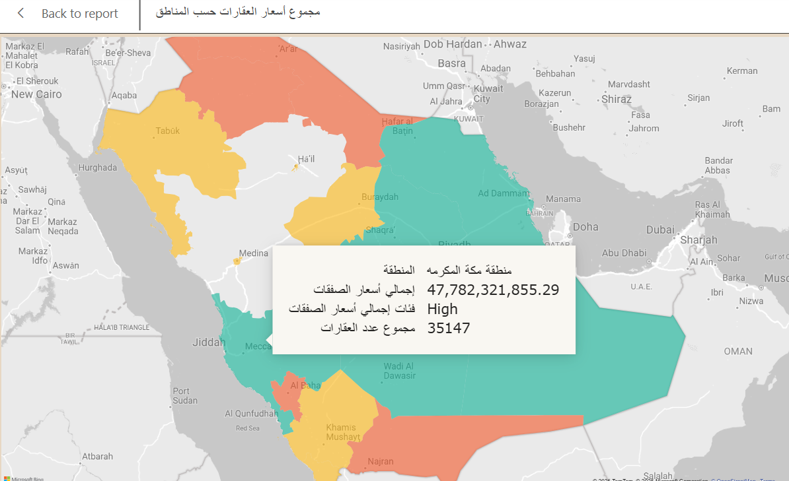

# Real Estate Transactions In Saudi Arabia 2024

This project demonstrates a **comprehensive approach to data cleaning, transformation, visualization, and analysis**, highlighting key findings and insights extracted from real estate transaction data for Saudi Arabia in 2024.

The dataset contains **176,390 rows**, covering key details such as transaction dates, regions, cities, neighborhoods, property classifications, prices, and areas. This dashboard is designed to demonstrate the step-by-step process I implemented for **data cleaning, transformation, visualization, and analysis**, emphasizing the methods and techniques used.

---

## 📋 Data Preparation with Power Query
Using Power Query, I prepared the dataset as follows:  
1. **Removed duplicate rows** to ensure data accuracy.  
2. Verified and corrected **data types**.  
3. **Removed blank values** for cleaner analysis.  
4. Appended multiple datasets into a **single consolidated table**.  

---

## 📊 Data Visualization in Report View
### Key Features:
1. **Custom DAX Measures**:  
   - **Total Number of Properties**.  
   - **Total Transaction Value (Sum of Prices)**
   - **Average Price per Square Meter**.  

2. **Interactive Visualizations**:  
   - **Map**:  
     - Regions are color-coded (Green: High Value, Yellow: Medium Value, Red: Low Value).  
     - Added a **tooltip** showing transaction value category when hovering over the map.  
   - **Line Chart**: Number of transactions by month.  
   - **Pie Chart**: Property classifications (Residential, Commercial, Agricultural).  
   - **Column Chart**: Total transaction values by neighborhood.  
   - **Bar Chart**: Property counts by city and neighborhood.  
   - **Cards**: Displaying total properties, neighborhoods, and cities.  
   - **Table**: Detailed property information for deeper analysis.  

3. **Dynamic Slicers**:  
   - Filters for **Category, Quarter, Region, City, Neighborhood, Price, and Area**, making the dashboard interactive and user-friendly.  

---

## 🎯 Key Findings
### A. Performance by Neighborhoods:
1. **Number of Transactions**:  
   - **Al-Nazeem**, Riyadh, recorded the highest number of transactions with **7,710 transactions**.  
2. **Total Transaction Values**:  
   - **Al-Narjis**, Riyadh, achieved the highest total transaction value of **6.88 billion SAR**, making it the most valuable neighborhood.  
   - **King Abdulaziz Road Project**, Mecca, followed with a total transaction value of **6.42 billion SAR**.  

### B. Property Types:
- Residential properties dominate the market, accounting for **86.19%** of all transactions, reflecting the high demand for residential real estate compared to other types.  

### C. Temporal Analysis:
1. **Least Active Month**:  
   - April recorded the lowest number of transactions, likely due to **Eid Al-Fitr** coinciding with this period. A more detailed analysis showed that the least active days in April align with the Eid Al-Fitr days, explaining the drop in transaction volume.
 
2. **Most Active Month**:
   - July was the most active month, indicating a significant increase in transactions at the start of Q3.  

### D. Performance by Regions:
1. **Top Regions by Transaction Value**:  
   - **Riyadh**: Ranked first with a total transaction value of **109 billion SAR**.  
   - **Mecca**: Ranked second with **47 billion SAR**.  
   - **Eastern Region**: Ranked third with **26 billion SAR**.  

### E. Total Transactions in 2024:
- The total number of real estate transactions in Saudi Arabia for 2024 reached **181,953 transactions**.  

---

## 💻 Tools and Skills
- **Tools**:  
  - Power BI, DAX, Power Query.  

- **Skills**:  
  - Data cleaning and transformation.  
  - Advanced DAX for reusable measures.  
  - Interactive dashboard design with dynamic slicers and tooltips.  

---

## 📷 Screenshots
1. **Dashboard Overview**  

     

2. **Interactive Map with Conditional Formatting**  

     

---

## 🚀 How to Use This Dashboard
Power BI file (`RealEstateDashboard.pbix`).
